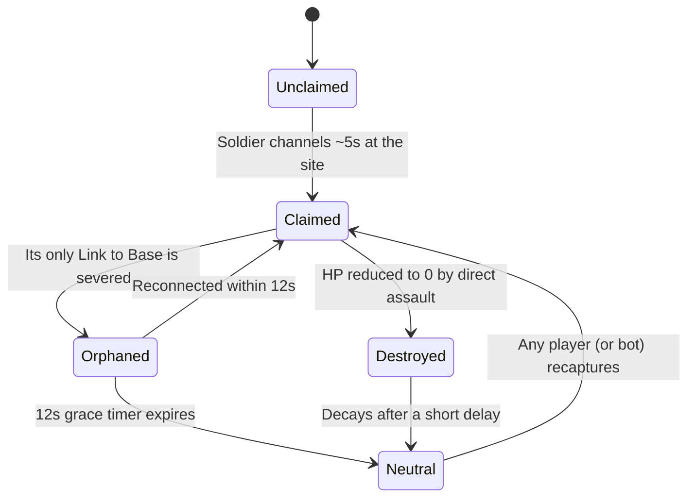
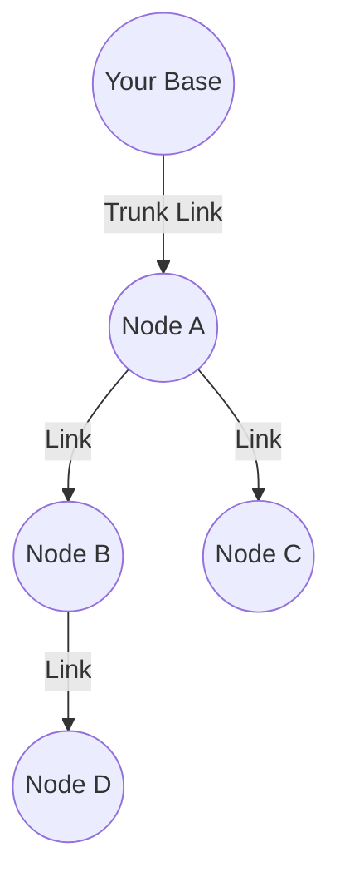

# Nodus.io — Full Game Design Document & Build Prompt

*Working title — see §20 for alternates. Genre: real-time multiplayer/singleplayer .io strategy-conquest game.*

## How to Use This Document
This is written to double as a **human-readable design doc** and a **drop-in prompt** — copy the whole thing into Claude Code, another AI coding tool, or hand it to a human developer, and there's enough here (mechanics, numbers, control scheme, data model, architecture) to start implementing directly. Numbers marked "suggested" are deliberately concrete so there's something to build and playtest against, not because they're final — tune everything through actual play.

## Table of Contents
1. [Elevator Pitch & Design Pillars](#1-elevator-pitch--design-pillars)
2. [Inspirations — What Each Game Contributes](#2-inspirations--what-each-game-contributes)
3. [Why the Node-Link Mechanic Is the Actual Hook](#3-why-the-node-link-mechanic-is-the-actual-hook)
4. [Platforms & Game Modes](#4-platforms--game-modes)
5. [The World / Map](#5-the-world--map)
6. [The Base](#6-the-base)
7. [Nodes](#7-nodes)
8. [Links](#8-links)
9. [Soldiers](#9-soldiers)
10. [Eatables & Resource Economy](#10-eatables--resource-economy)
11. [The Boss](#11-the-boss)
12. [Progression & Leveling](#12-progression--leveling)
13. [Combat, Capture & Elimination Rules](#13-combat-capture--elimination-rules)
14. [Bots](#14-bots)
15. [UI / HUD](#15-ui--hud)
16. [Visual & Audio Direction](#16-visual--audio-direction)
17. [Technical Architecture](#17-technical-architecture)
18. [Open Design Questions](#18-open-design-questions)
19. [Future / Post-MVP Ideas](#19-future--post-mvp-ideas)
20. [Suggested Working Titles](#20-suggested-working-titles)

---

## 1. Elevator Pitch & Design Pillars

Every player starts with a single pulsing **Base**. From it, you grow a living network of **Nodes** connected by glowing **Links** — claiming territory not as a blob or a colored region, but as a fragile, branching graph, exactly like the note-graph screenshots you shared. Small, automatically-produced **Soldiers** roam your network: harvesting XP from scattered **Eatables**, defending on instinct when danger gets close, and — on your command — going on the offensive to sever an enemy's Links or storm their Nodes and Base outright. Cut the right Link and an opponent's entire branch of the network goes dark at once, even if you never touched the Nodes hanging off it. Destroy a Base and that player is out. Survive, expand, and dismantle every rival's network until only one Base is still pulsing.

**Design pillars** (decisions should serve these, roughly in priority order):
1. **The graph is the game.** Every system should reinforce that territory is connective, not areal. If a feature would work just as well in a blob-territory game, it isn't pulling its weight here.
2. **A small, sharp player can hurt a large, careless one.** Raw size should never guarantee safety — Link vulnerability is the great equalizer, and it should stay that way even as other numbers get tuned.
3. **Legible at a glance.** Zoomed all the way out, the map should tell you who's strong, who's exposed, and where the fighting is, through color and glow alone.
4. **Active beats passive, but passive isn't a trap.** Automatic defense keeps an AFK player from instantly losing everything; a present, attentive player should always be able to outperform it.

## 2. Inspirations — What Each Game Contributes
- **diep.io** — the XP-from-shapes economy, tank-style leveling, and stat/branch upgrade choices all come from here. diep.io's *Factory* class is the closest existing precedent for this game's whole Base-and-Soldiers idea: a handful of drones that auto-attack anything nearby when you're not steering them, and snap to obey the moment you take control. Nodus.io essentially takes that one tank's sub-mechanic and makes it the entire game.
- **territorial.io** — the real-time, whole-map conquest feel, the single-player-vs-bots-plus-multiplayer structure, and "one empire left standing" all come from here. Its alliance/truce system is also the direct ancestor of an idea in §19 (allied networks literally linking together).
- **florr.io** *(you wrote "flowr.io" — this is almost certainly the game you mean, built by the same developer as diep.io and agar.io)* — contributes the softer, organic visual register worth borrowing for how Nodes "bloom" into existence, as a nice contrast to the harder mechanical look of your Base/Soldier sketches. Its zone-based risk/reward map (safer at the edges, better rewards toward the center) is echoed in §5.
- **Your own reference images** — the Obsidian graph-view screenshots aren't just mood-board material, they're close to a literal spec: a bright, colored hub with lines radiating out to nodes, fading into a huge pale-gray web of everything else. That's this game's map, zoomed out. Unclaimed territory should look exactly like those faded gray dots; a developed network should look exactly like that bright starburst.
- **(Bonus, unprompted) paper.io** — worth a look even though you didn't mention it. Its core tension — you draw a trail to expand, and anyone who touches that trail before you close the loop kills you instantly — is the closest existing mechanic to "break the links," and studying its game-feel will help when tuning how dangerous Link-sniping should feel here.

## 3. Why the Node-Link Mechanic Is the Actual Hook
Territory-conquest .io games are almost all built on **area** — a blob, a colored region, a filled-in loop. Area has one dominant strategy: get bigger, because bigger is safer. That's why these games tend to funnel into "whoever's biggest wins, everyone else is feeding them."

Territory as a **graph** changes the math. A network's strength — soldier production, XP income, map control — still grows with size, but so does its exposed surface area of Links, and every Link is a single point of failure for everything hanging off it. A small, skilled player can't out-muscle a sprawling empire, but they *can* scout for its thinnest, worst-defended trunk Link near its Base and sever a dozen Nodes in one strike. That's a skill expression blob-based games structurally can't offer, and it's the reason to build this instead of another conquest clone.

## 4. Platforms & Game Modes
- **Singleplayer / Practice** — you vs. AI bots only, adjustable bot count and difficulty, no other humans required. Runs entirely client-side — this also happens to be the natural first build milestone (§17).
- **Multiplayer Free-For-All** *(main mode)* — server-hosted arena rooms of roughly 40–100 players (bots fill empty seats), round-based: play until one Base remains, then the arena resets. This is the literal "last one standing wins" mode from your brief.
- **Multiplayer Endless / Leaderboard** *(secondary mode)* — same map, no round reset; eliminated players respawn with a fresh Base elsewhere; ranking is by longest survival streak, peak network size, or total XP. Good for casual drop-in play.
- *(Future, not MVP)* Teams/Alliances and a shrinking-safe-zone Battle Royale variant — both discussed as stretch goals in §19.

## 5. The World / Map
- A large, bounded, top-down 2D arena — comparable in scale to diep.io's arena, big enough that ~100 simultaneous networks don't instantly collide.
- The floor is seeded with a **constellation of potential Node-sites**: a Poisson-disc-sampled scatter of points, organically spaced rather than gridded, rendered as small pale-gray dots — exactly like the unclaimed dots in your Obsidian screenshots. A Link can only ever terminate at one of these sites, which is what keeps the graph looking like a graph instead of a formless blob.
- **Risk gradient**: the map center holds denser Node-sites, rarer Eatables (Types 3–4), and the Boss spawn pool — the same "best loot is in the most contested spot" tension diep.io uses. The outer ring is safer and better for a new Base's opening minutes.
- **Fog of war**: anything outside your (or an ally's) vision radius renders dimmed/last-known-state — a direct match for how Obsidian's graph view fades everything outside your focused node to pale gray.
- Floor texture: a soft dot-grid background, matching the diep.io-style backdrop in your sketch.

## 6. The Base
Your Base is the rotating gear/engine from your sketch — visually and mechanically the heart of your empire.

**Stats**: HP, Production Rate (Soldiers/sec), Level, Link Range (max distance to a new Link), Link Capacity (max simultaneous outgoing Links), Vision Radius.

**Suggested starting values**: 1,000 HP · 1 Soldier every 4s · Link Range 400 units · Link Capacity 3 (rising with level — §12).

- The Base **auto-spawns Soldier-1 units continuously**, no player input required, arranged in the concentric ring your sketch labels "Layer 1." Higher Base levels unlock additional rings ("Layer 2," etc.) — both a real population-cap increase and a nice at-a-glance read of "how strong is that empire" from across the map.
- **Losing the Base = elimination**, full stop, regardless of how many Nodes you still hold — the cleanest reading of "last one standing wins," and what §13 builds on. On death, your remaining Nodes go neutral after a short grace window, and a burst of bonus Eatables spawns at the Base's last position as a reward for whoever secured the kill.

## 7. Nodes
A Node is a claimed Node-site — the graph-theoretic unit of territory. Each Node provides:
1. **Vision** — extends what you can see.
2. **A small resource/XP trickle** — Nodes don't spawn Soldiers themselves at first (kept Base-exclusive early on to keep the opening game simple), but reinforced Nodes can (below).
3. **A new anchor point** — further Links can only branch from an owned Node or the Base, so Nodes are literally how your reach extends across the map.
4. **A forward rally point** — Soldiers can garrison at a Node instead of the Base, useful for staging an attack or holding a contested frontier.

**Claiming a Node**: select a Soldier (any type can do this — no bonus for specialists here), send it to an adjacent unclaimed Node-site within Link Range of an existing Node/Base, and it channels for **~5 seconds** uncontested to claim it, drawing the glowing Link line back to its parent the instant it completes. Taking damage while channeling interrupts the claim.

**Node Reinforcement** *(unlocked at Base level 12 — §12)*: spend XP to upgrade a Node, increasing its HP, giving it a small Soldier-production trickle of its own, and unlocking a second outgoing Link slot from it. This is what turns a thin chain into the dense, branching web your reference images show.

**Suggested starting Node stats**: 300 HP, 12-second orphan grace timer (§8).

## 8. Links
The signature mechanic. A Link is the literal glowing line between two owned points (Node↔Node or Base↔Node), rendered exactly like the purple lines in your Obsidian screenshots, in your network's accent color.

**The rule that makes this game what it is**: every Node must have an unbroken chain of Links back to the Base to stay supplied. A live connectivity check runs from the Base outward every time a Link is destroyed. If the cut Link was the *only* path to some subtree of Nodes, that entire subtree — no matter how large — goes **Orphaned**. An Orphaned Node has **12 seconds** to get reconnected (a new Link built to it from anywhere still-connected) before it decays into **Neutral** and becomes free for *anyone*, including bots, to claim.

That's the whole game in one sentence: **sever a trunk Link near someone's Base, and you can amputate a dozen Nodes they spent ten minutes building, without ever touching those Nodes directly.**

**Suggested Link stats**: 120 HP — deliberately the *weakest* structure in the game (Links < Nodes < Base by design), regenerating 2 HP/sec once left unmolested for 5+ seconds, so a single hit-and-run poke can't permanently cripple you. Severing something has to be a real, committed push, which is what gives automatic defense (§9) a fair chance to respond.

**Diagram — a Node's lifecycle:**



**Diagram — why trunk Links matter more than leaf Links:**



Sever only the Base→A trunk Link, and Nodes A, B, C, and D — everything downstream — go Orphaned within the same second, even though an attacker never came near B, C, or D. Compare that to severing B→D alone: you only lose D. Positioning and target priority matter enormously, which is exactly the skill expression §3 is about.

## 9. Soldiers
**Control scheme** (straight from your sketch, and genuinely novel for the .io genre — most .io games use either a single controllable avatar like diep.io, or "everything moves at once" like territorial.io; this is closer to a lightweight RTS):

| Input | Action |
|---|---|
| Left-click a Soldier | Select just that one |
| Right-click-drag | Box-select every friendly Soldier in the rectangle |
| Left-click empty ground (units selected) | Move there |
| Right-click empty ground (units selected) | Attack-move (go there, auto-engage anything encountered en route) |
| Click an Eatable (units selected) | Send them to harvest it |
| Click an unclaimed Node-site (units selected) | Begin claiming a Node there |
| Click an enemy Soldier / Node / Link / Base | Attack it |
| Scroll wheel | Zoom |
| Drag empty space / WASD / arrows | Pan camera |
| Spacebar | Snap camera to your Base |

**Automatic defense** (explicitly from your sketch's note): any *idle, unselected* Soldier near a friendly Node/Base/Link auto-engages the instant an enemy Soldier enters a short radius around it — no click required. This is the baseline safety net when you're not actively watching. Soldiers you've selected and moved follow your orders and won't go looking for a fight on their own, but will still auto-fight anything that attacks them mid-move.

**Unit roster** *(small at launch, expandable later)*:

| Unit | Role | HP | Damage | Speed | Special | Unlocks |
|---|---|---|---|---|---|---|
| Soldier-1 (Grunt) | Balanced default | 20 | 4 | Normal | Auto-spawned continuously; every other unit is trained from this baseline | Level 1 |
| Harvester | XP farming | 15 | 2 | Fast | +75% XP from Eatables | Level 3 |
| Sentinel | Defense specialist | 35 | 5 | Slow | +50% damage while auto-defending; larger auto-aggro radius | Level 8 |
| Saboteur | Link/Node breaker | 15 | 3 (×2 vs. Links & Nodes) | Fast | Purpose-built for the "break enemy links" half of the game | Level 8 |
| Vanguard | Elite all-rounder | 50 | 9 | Normal | Strongest raw stats in the game | Level 20 |

## 10. Eatables & Resource Economy
Pulled directly from your sketch, formalized with numbers:

| Type | Shape / Color | Rarity | XP | Typical Location |
|---|---|---|---|---|
| Type 1 | Yellow cube | Common | 1 | Everywhere |
| Type 2 | Purple triangle | Uncommon | 4 | Mid-map |
| Type 3 | Blue cube | Rare | 12 | Near the contested center |
| Type 4 | Red star | Very rare | 35 | Deep-center hotspots |

Only **selected, player-directed** Soldiers harvest Eatables, matching your note about actively "select[ing] individual soldiers to gain XP attacking eatables." It's not passive — deciding how many Soldiers to pull off defense or expansion duty to go farm is a real, constant trade-off.

Eatables respawn continuously at a rate that scales with player count, so the map never runs dry.

## 11. The Boss
The oversized, spiked yellow cube from your sketch. Spawns at a **random location roughly every 15 minutes**, your number, kept as-is. Suggested HP: ~5,000 — enough that it realistically takes multiple Soldiers, often from more than one network, to bring down, which creates great emergent moments: an uneasy shared push, then an immediate scramble for the kill. Reward: a large XP burst split among the top damage-contributing networks, plus a bonus — e.g. an instant free Node claim at the Boss's location — for whoever lands the finishing blow.

## 12. Progression & Leveling
Two layers, diep.io-style:

**A. Base Level** (from cumulative network XP) — unlocks higher-tier units, more Link capacity, bigger Link Range, faster production.

| Level | Unlocks |
|---|---|
| 1 | Base, auto-spawning Soldier-1, 1 concurrent Link |
| 3 | Harvester unit |
| 5 | 2nd concurrent Link from Base; +20% Node claim range |
| 8 | Sentinel & Saboteur units; +25% auto-defense radius |
| 12 | Node Reinforcement (§7) |
| 15 | Choose a Specialization (below) |
| 20 | Vanguard unit; +30% Base HP |

**B. Specialization** *(chosen once, at level 15)* — gives each empire a distinct flavor:

| Branch | Identity | Perks |
|---|---|---|
| **Sprawl** | Economic / expansionist | Node claim time −40% · +1 Link slot per Node/Base · +25% Eatable XP |
| **Bastion** | Defensive / turtle | +40% Node & Link HP and regen · +50% auto-defense radius · +30% Base HP |
| **Warmonger** | Offensive / aggressive | +25% Soldier damage · +30% faster Soldier production · +15% attack-move speed |

## 13. Combat, Capture & Elimination Rules
- Bases, Nodes, and Links all just have HP that Soldiers reduce on hit — one consistent combat rule everywhere, nothing separate to learn.
- **Capturing** a still-connected enemy Node requires cutting its supply first (§8) — you can't flip a Node that's still receiving supply just by parking an army on it. This is deliberate: the *only* way to take territory is to out-position an opponent's connectivity, never to simply out-muscle a single point. *(Alternative in §18 if you'd rather allow a direct siege-capture option.)*
- Base HP → 0 = **instant elimination**, independent of remaining Nodes. Because Node loss alone never eliminates you, a player reduced to just their Base can still mount a comeback — resilience is built in without a separate "soft elimination" rule.
- A round ends the moment exactly one Base remains active in that arena instance.
- Suggested: a short (~20s) spawn-protection grace period on new Bases, matching a pattern both diep.io and territorial.io use to stop instant re-elimination.

## 14. Bots
Bots fill empty seats so a match never feels dead, scaling down automatically as real players join — matching your note to "have multiple enemies and some bots enemies," and mirroring how territorial.io keeps its world populated. Suggested tiers:
- **Passive** — barely expands, minimal threat, easy early XP.
- **Standard** — expands and defends competently.
- **Aggressive** — actively hunts nearby weak networks and opportunistically snipes trunk Links, i.e. plays the game the way a sharp human would.

## 15. UI / HUD
- **Minimap**: your network's live topology, color-coded per player — a smaller version of the exact Obsidian graph-view look from your screenshots.
- Leaderboard (by network size / level / survival time).
- Base HP + Level bar, a selected-unit info panel, and a notification feed (e.g. "Your Link to Node 14 is under attack!").
- Top-down camera, pannable and zoomable, with an auto-follow toggle.

## 16. Visual & Audio Direction
- Keep your sketch's iconography — gear-shaped Base, small triangular Soldiers, flat-colored geometric Eatables — but rendered clean and vector, flat shapes with soft shadows.
- **Links glow in your network's accent color**, literally reusing the purple-line look from your reference screenshots; give each player a distinct hue so a zoomed-out match looks like a colorful, living graph view.
- Unclaimed Node-sites: small pale-gray dots, again straight from your screenshots.
- Node-claim animation: a soft "bloom," borrowing florr.io's organic register as a nice contrast to the harder mechanical Base.
- Audio: a soft chime when a Link forms, a sharp snap when one's severed, a low mechanical hum from Bases, a satisfying pop on eating an Eatable.

## 17. Technical Architecture
- **Client**: Canvas2D or PixiJS (WebGL) renderer; quad-tree spatial partitioning for render culling and click hit-testing at scale.
- **Server**: authoritative Node.js game loop at a fixed tick (~20Hz); WebSocket transport — plain `ws`/socket.io, or Colyseus, which is purpose-built for exactly this kind of room-based real-time .io game.
- **Sync**: interest-managed state (only send each client the slice of the world near their viewport/network) — the standard trick every .io game at this scale uses to keep bandwidth sane.
- **Authority**: server recomputes all combat, connectivity checks, and captures; never trust client-reported positions or HP.
- **Persistence**: in-memory per arena room is enough for MVP; add Redis/Postgres later for cross-match leaderboards and accounts.

### Suggested Data Model
A starting shape for the core entities — enough to hand straight to a codegen tool:

```typescript
interface Base {
  id: string;
  ownerId: string;
  position: { x: number; y: number };
  hp: number; maxHp: number;
  level: number; xp: number;
  linkCapacity: number; linkRange: number; visionRadius: number;
  specialization: "sprawl" | "bastion" | "warmonger" | null;
}

// Named `GraphNode` to avoid clashing with the DOM's built-in `Node` type.
interface GraphNode {
  id: string;
  ownerId: string | null;              // null = neutral
  position: { x: number; y: number };
  hp: number; maxHp: number;
  reinforced: boolean;
  parentLinkId: string | null;         // the Link that supplies it
  status: "unclaimed" | "claimed" | "orphaned" | "neutral";
  orphanedAt: number | null;           // timestamp, drives the 12s grace timer
}

interface Link {
  id: string;
  ownerId: string;
  fromId: string;                      // a Base or GraphNode id
  toId: string;                        // a GraphNode id
  hp: number; maxHp: number;
  lastDamagedAt: number;               // drives the regen-after-5s-idle rule
}

interface Soldier {
  id: string;
  ownerId: string;
  type: "grunt" | "harvester" | "sentinel" | "saboteur" | "vanguard";
  position: { x: number; y: number };
  hp: number;
  order: {
    kind: "move" | "attackMove" | "attack" | "harvest" | "claim" | "idle";
    targetId?: string;
    position?: { x: number; y: number };
  };
  selected: boolean;
}

interface Eatable {
  id: string;
  type: 1 | 2 | 3 | 4;
  position: { x: number; y: number };
  xpValue: number;
}
```

**Elimination/connectivity check**: on every event where a Link's HP reaches 0, run a BFS/DFS outward from each surviving Base across that owner's remaining Links. Any Node not reached flips to `orphaned` and starts its 12-second timer; any Node still `orphaned` when the timer fires flips to `neutral`.

### Suggested Build Order
1. **Client-only singleplayer prototype** — one Base, the Node/Link graph, bots, the full core loop, playable locally. This *is* your singleplayer mode (§4) — no separate build needed for it later.
2. Soldier pathing/combat and the connectivity-cut algorithm — the heart of the game; get this rock-solid before anything else.
3. A minimal authoritative multiplayer server for 2+ human players in one room.
4. Bots-as-server-agents, room matchmaking/fill, leaderboard.
5. Polish — audio, animation "juice," mobile touch controls, cosmetics.

## 18. Open Design Questions
Worth deciding before or during the build — a recommended default is listed first in each:
- **Round-based vs. persistent** — *Recommended:* round-based FFA as the primary mode (matches "last one standing wins" literally), persistent Endless as a secondary casual mode. Both described in §4.
- **Node capture — disconnect-first vs. direct siege** — *Recommended:* disconnect-first (§13), for a clean strategic identity. *Alternative:* allow direct capture of a still-connected Node if enough enemy Soldiers hold it for a sustained duration — faster-paced, but muddies the "the graph is everything" identity.
- **Teams/Alliances** — scope for launch, or a post-MVP addition? Leaning toward post-MVP (§19).
- **Numeric balance** — every HP/damage/XP/timer value in this doc is a reasonable starting point, not a final answer. Needs real playtesting.

## 19. Future / Post-MVP Ideas
- **Alliances that literally merge networks** — territorial.io has truces; here, two allied players could physically Link their Bases together, sharing vision and defense, with an obvious betrayal risk built right into the shared graph.
- Shrinking-safe-zone Battle Royale variant.
- Cosmetic Base/Link/Soldier skins as non-pay-to-win monetization, standard for the genre.
- Mobile touch controls (tap-to-select, drag-to-box-select).
- Replay/spectate mode.

## 20. Suggested Working Titles
- **Nodus.io** *(used throughout this doc)* — Latin for "knot/node," short and punchy in the diep/slither/paper naming tradition.
- **Synapse.io** — leans into the neural-network read of the graph visual.
- **Linkfall.io** — foregrounds the "links get cut" tension.
- **Meshwar.io**
- **Netsiege.io**
